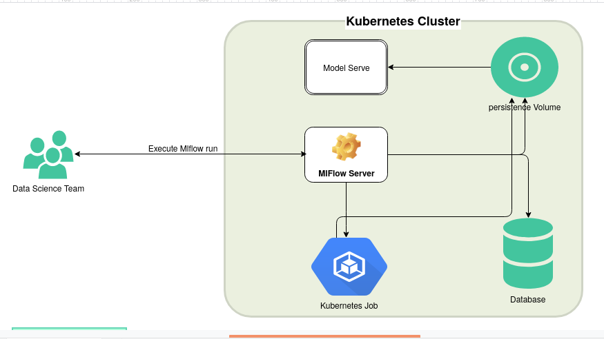

# MLflow Project on Kubernetes
  
The purpose of the project is to demonstrate how to create, dockerized and run a
MLflow project in the kubernetes cluster. Data science team gets easy access to the 
scalable kubernetes platform with MLFlow to train, test and deploy the models. 
Also gets standard pipeline templates to manage project dependencies and create 
a convenient model pipelines with model serving for Data Science Team. The templates 
provided are simple enough for Data Science team to consume, so that they can spend
more time on models and data than on platform.


## Getting Started

When installing the Kubernetes cluster from scratch & scale out mlflow job on kubernetes we are encouraged to follow the order specified below
1. Platform setup & configuration Steps
2. Create MLflow project using docker (rather than conda) to manage project dependencies. [sample Project](examples/LogisticRegression)
3. Create your ml model serve flask api service based on your use cases. [Sample project](examples/FlaskMlflowServe)

### End to End Flow Diagram:

### Software Prerequisites
1. Linux-specific Software Requirements
   * Ubuntu 18.04
   * Snap  - for microk8s setup
   * Virtualbox/Kvm Driver - for Minikube setup
2. Use Python 3.6
   
   In Ubuntu, Mint and Debian you can install Python 3 like this:
     ```bash
      sudo apt-get install python3 python3-pip
     ```
 3. Install Kustomize
   ```bash
    opsys=linux 
    curl -s https://api.github.com/repos/kubernetes-sigs/kustomize/releases/latest |\
      grep browser_download |\
      grep $opsys |\
      cut -d '"' -f 4 |\
      xargs curl -O -L
    mv kustomize_*_${opsys}_amd64 /usr/local/bin/kustomize
    chmod u+x kustomize
   ```

### Platform setup & configuration Steps
The followed context describes all the installation process for to run the Mlflow project on  **Amazon EKS/minikube/microk8s** Cluster starts from scratch. This will covers all aspects of its installation, including all various softwares needed & how to deploy the required services on kubernetes cluster. Follow these general installation and configuration steps, located in this below section

1. Install and configure the MiniKube/Microk8s Cluster
2. Clone the repo
3. Create a new namespace for our application
4. Create a new secret for our application
5. Additional Software Requirements

#### 1. Install MiniKube/Microk8s/Amazon EKS Cluster
There are so many open source tools are available in market now a days to build kubernetes cluster. Here we are, covered in Minikube,Amazon EKS and Microk8s installation process. It depends on your needs you can **install any one** of them.
* Install **Minikube** to work with Kubernetes on a local environment for purpose. Check the [Install-MiniKube-with-Kvm2-Driver.md](doc/Install-MiniKube-with-Kvm2-Driver.md) to Install MiniKube with Kvm2 Driver
* Install **Microk8s** to work with Kubernetes on a Multi node cluster purpose. Check the [Install-microk8s-Mlulti-Node-cluster.md](doc/Install-microk8s(Mlulti-Node-cluster).md) to Install microk8s
* Install **Amazon EKS** to work with Kubernetes on a Multi node cluster purpose. Check the [Install-and-configure-Amazon-EKS-Cluster](doc/Install-and-configure-Amazon-EKS-Cluster.md) to Install miok8s

##### Note: In our Example project we used Microk8s

#### 2. Clone the repo
Clone this repository. In a terminal, run:

```
$ git clone https://gitlab.pramati.com/srinivasanr/mlflowonkubernetes.git
```
#### 3. Create namespace in kubernetes
To isolate our list of Pods,Services and Deployments we use to build and run their platform setup, we needed to create separate namespace.

Run below command to create namespace in kubernetes:
```
# Minikube/EKS
$ kubectl create ns <your namespace>

# MicroK8s
$ microk8s.kubectl create ns <your namespace>
```

#### 4. Create a new secret for our application
To pull Docker image from private Docker registry we need to create secret.

Run below command to create **dockerconfigjson** file
```bash
docker login
```

Run below command to create secret in kubernetes
```bash
 kubectl create secret generic regcred -n <your namespace>  --from-file=.dockerconfigjson=/home/<username>/.docker/config.json --type=kubernetes.io/dockerconfigjson #replace username & namespace
```

#### 5. Additional Software Requirements
The following service are required to run a mlflow project on kuberenets Cluster
1. Mysql
2. Mlflow Server
3. Nexus

If you want to deploy the services through automation process, follow these general configuration and deployment steps
##### a. Update Meta data information in `setting.py`(src/lib/settings.py)
```python
config = {
  "namespace": "mlflowonkube",
  "cluster": "microk8s", # cluster type name based on your installation
  "master_ip":"172.17.1.229",  
  "kubectl":"microk8s.kubectl", #kubernetes command line
  "kube_context":"microk8s", #get kube context name from `~/.kube/config` file
  "mysql": {
    "user":"pramati", #mysql username
    "password": "password123", #mysql password
    "dbname":"mlflow", #mysql database name
    "port":"3306",    # target port
    "nodePort":"30036", # expose port 
    "mountPath": "/var/lib/mysql", # volumn mount path
    "storage":"1Gi", # maximum storage size
    "isSkip": False # help to skip this service setup if it's true
  },
  "mlflow": {
    "port":"5002",
    "nodePort":"30035",
    "mountPath": "/mnt/mlflow", 
    "storage":"1Gi",
    "docker_image": "172.17.1.229:32000/mlflow-server:registry", # private microk8s Docker registry image name
    "isSkip": False
  },
  "nexsus": {
    "mountPath": "/mnt/nexsus",
    "docker_image": "sonatype/nexus3",
    "isSkip": False
  },
  "flask": {
    "mountPath": "/mnt/mlflow",
    "nodePort":"30091",
    "docker_image": "172.17.1.229:32000/mlflow-flask:registry",
    "run_id":"fe25e92156fa4b10b6b3a165a31ce676" # mlflow job run id
  },
  "kube_job": {
    "projectname":"LogisticRegression", # custom kubernetes mlflow project name
    "mountPath": "/mnt/mlflow", # volumn mount path to store artifacts
    "entry_cmd":"train.py --alpha {alpha} --l1-ratio {l1_ratio}", #entry command to train model
    "docker_image": "172.17.1.229:32000/mlflow-flask:registry", # private microk8s Docker registry image name
    "limit_mem":"512Mi", # maximum memory required to completed the model training
    "requests_mem":"256Mi", # initial Required memory
    "maintainer" :"srinivasan.ramalingam@imaginea.com"
  }
}
```

##### Note: To understand more in detail how this process internally works check this [doc](doc/Manual-Deployment-process-for-additional-required-service.md)


##### a. Run below command to start the aumotated process
```bash
python service_helper.py --setup_platform
```

After running, you can view the services through Kubernetes Dashboard:
In the browser, go to https://127.0.0.1:10443 (``we use microk8s, the port may be varied in your case``), you will get the following service are up.
1. Mysql
2. Mlfowserver
3. Nexus

To verify the pods status run below command
```bash
kubectl get pods -n <namespace> #replace with your namespace name
```
output:
```bash
minikube-mlflowserver-598d8b755d-z9jzp       0/1     Running            2          6m29s
minikube-mysql-7c58cc749b-xj5dt              0/1     Running            4          21m
minikube-mysql-client                        1/1     Running            1          21m
minikube-nexus-deployment-5dc4796c54-fxw2j   1/1     Running            2          6m29s
```

###### a.1 command to generate Sample Mlflow project
Using this below command **Data Science Team Member** can generate sample mlflow project & apply  own implementation on top of it. before that you have to modify the `kub_job` section in **settings.py** based on your need. 
```bash
python service_helper.py --generate_ml_template
```
```bash
__main__     INFO     current output Directory Path /home/srinivasan/workspace_python/cluster_setup/output/1583304596398
__main__     INFO     template render the files in /home/srinivasan/workspace_python/cluster_setup/src/lib/template/mlflow folder
__main__     INFO     template has been generated in MlflowTemplateGen service
__main__     INFO     Sample Template generated in /home/srinivasan/workspace_python/cluster_setup/output/1583304596398/mlflow_on_kubernetes folder
```
